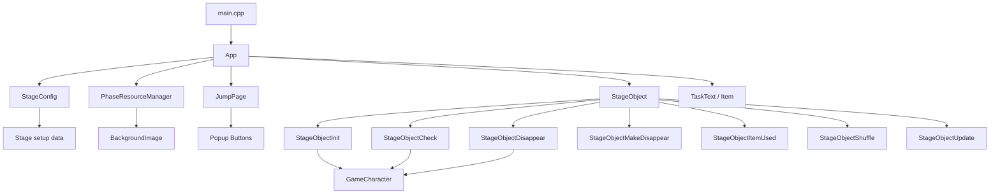
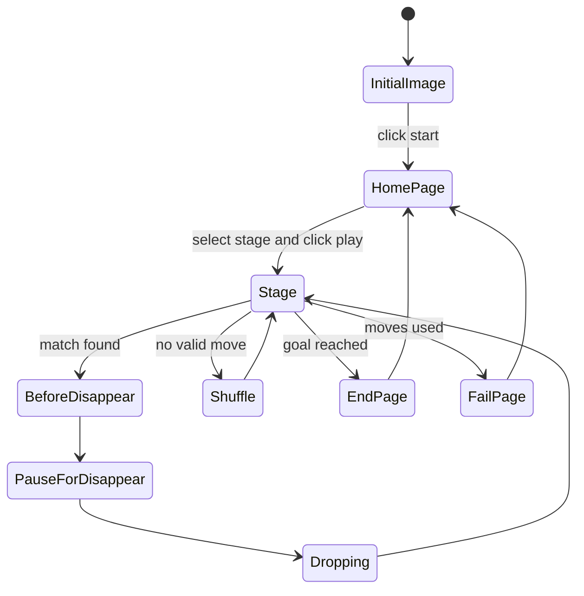

# LINE POP2 Architecture Report

目前版本是使用 PTSD 框架完成的 Line Pop2 第一關 Demo。架構分成六層：

```text
Build Layer
  CMakeLists.txt / files.cmake

Application Layer
  main.cpp / App

Scene and Flow Layer
  PhaseResourceManager / JumpPage / AppStage

Config Layer
  StageConfig

Game Logic Layer
  StageObject and stage systems

Presentation Layer
  Character / GameCharacter / Item / TaskText / BackgroundImage
```

## 架構圖



## 主要模組說明

### App

`App` 是遊戲主流程控制器，負責初始化物件、切換首頁與關卡、處理每一幀的遊戲流程。它不直接負責三消演算法，而是呼叫 `StageObject` 處理棋盤邏輯。

目前 `App` 的流程是：

```text
START
  -> Init
  -> UPDATE

UPDATE
  -> INITIAL_IMAGE
  -> HOME_PAGE
  -> STAGE

END
  -> Exit
```

### StageConfig

`StageConfig` 是關卡設定層。它集中管理關卡的基礎資料：

```cpp
struct StageConfig {
    int id;
    int boardSize;
    std::string backgroundImage;
    std::string goalImage;
};
```

`AppStage` 是透過 `GetStageConfig(stage)` 取得：

```text
關卡 id
棋盤大小
背景圖
目標圖示
```

目前展示版本在首頁放入第 1-10 關入口，但只有第 1 關有完整棋盤資料。第 2-10 關在 `StageConfig` 中被標記為 `hasBoard = false`，點擊後會進入空地圖作為 placeholder，方便之後逐步補上關卡內容。

### PhaseResourceManager

`PhaseResourceManager` 負責背景切換。現在新增 `NextStage(stage)`，可依照 `StageConfig` 的 `backgroundImage` 切換關卡背景；第 2-10 關目前只顯示空地圖背景。

### JumpPage

`JumpPage` 負責彈出頁面，例如關卡開始、關卡資訊、設定、暫停、通關、失敗等。它也持有彈窗中的按鈕。

### StageObject

`StageObject` 是三消遊戲的核心棋盤物件。它負責：

```text
初始化棋盤
處理方塊交換
檢查消除條件
產生特殊方塊
處理消除與掉落
處理道具效果
處理洗牌
更新分數與目標
```

`StageObject` 

```text
StageObjectInit.cpp
StageObjectCheck.cpp
StageObjectDisappear.cpp
StageObjectMakeDisappear.cpp
StageObjectItemUsed.cpp
StageObjectShuffle.cpp
StageObjectUpdate.cpp
```

這種分檔讓同一個 class 的不同功能分散在不同檔案中，短期內容易維持相容

## 關卡流程




```text
Board
  保存棋盤格子與方塊資料

MatchSystem
  判斷三消、四消、五消與特殊方塊

DropSystem
  處理掉落與補新方塊

ItemSystem
  處理道具

GoalSystem
  處理關卡目標

BoardView
  專門負責畫面顯示
```
