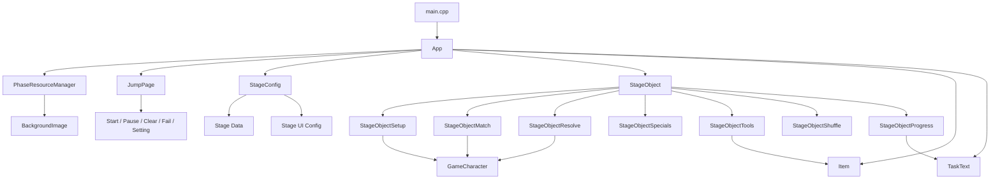
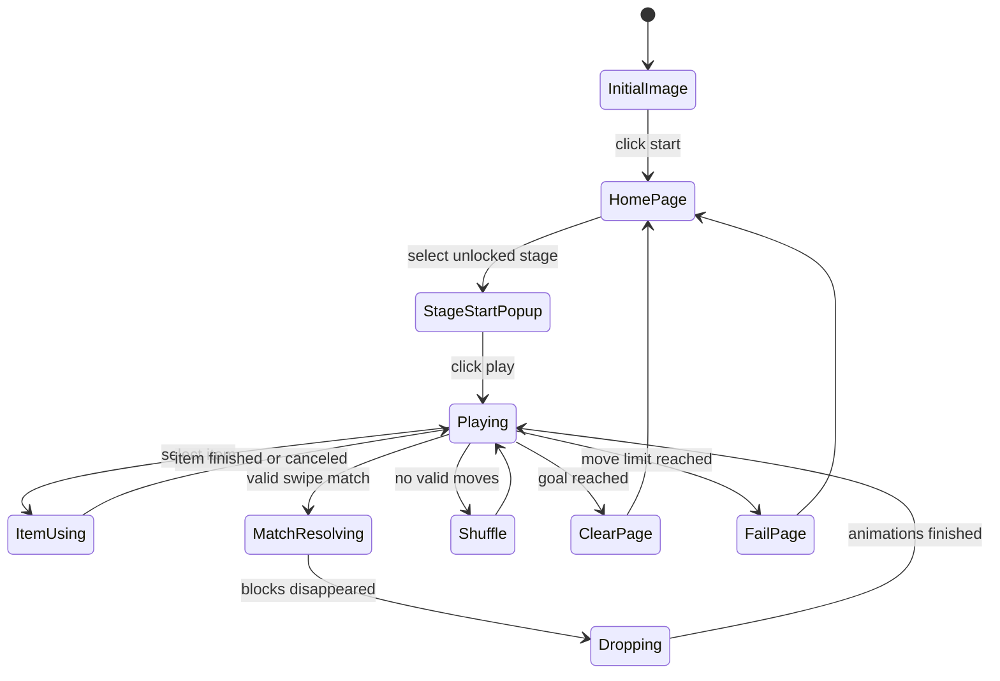

# 2025 OOPL Final Report

## 組別資訊

| 項目 | 內容 |
| --- | --- |
| 組別 | 第 X 組 |
| 組員 | 112820045 曾怡瑄、111820017 陳嘉祥 |
| 復刻遊戲 | LINE POP 2 |
| 開發框架 | PTSD Framework |
| 專案語言 | C++ |

## 專案簡介

本專案復刻 LINE POP 2 的核心遊玩流程，使用 PTSD Framework 製作 2D 三消益智遊戲。玩家可以在關卡地圖中選擇不同關卡，進入關卡後透過滑動相鄰方塊來交換位置，讓三個以上相同顏色或類型的方塊連成一線並消除。

目前版本已完成第 1 到第 10 關的可玩流程，包含關卡地圖、開始畫面、關卡任務、步數限制、通關與失敗判定、特殊方塊、障礙物、道具、Cheat Mode，以及方塊交換與掉落時的平滑動畫。第 11、12 關素材保留在資源資料夾中，但目前沒有開放成可進入關卡。

我們希望這個版本不是只把原本遊戲畫面重做，而是把三消遊戲最重要的規則拆成清楚的物件與模組。像是關卡設定集中在 `StageConfig`，棋盤邏輯集中在 `StageObject`，畫面物件由 `Character`、`GameCharacter`、`Item`、`TaskText` 負責，讓後續新增關卡或調整規則時不需要到處改程式。

## 遊戲介紹

### 基本玩法

玩家在首頁點選已解鎖的關卡後，會進入關卡開始畫面。進入遊戲後，畫面上會顯示棋盤、任務目標、剩餘步數、道具數量與暫停按鈕。

遊玩方式如下：

1. 按住一個普通方塊。
2. 往六個相鄰方向滑動。
3. 系統判斷滑動方向，交換目標相鄰方塊。
4. 若交換後形成三個以上相同方塊，方塊會消除。
5. 上方方塊掉落補位，空位會補上新方塊。
6. 若掉落後再次形成可消除組合，會繼續連鎖消除。

本遊戲的棋盤不是一般四方向方格，而是接近 LINE POP 2 的六方向相鄰棋盤。因此每個方塊會記錄自己的六個鄰居，用來判斷交換、消除與特殊方塊影響範圍。

### 關卡目標

目前已開放第 1 到第 10 關，每一關的棋盤大小、背景、目標、步數限制都由 `StageConfig` 管理。

| 關卡 | 目標類型 | 目標數量 | 步數 |
| --- | --- | ---: | ---: |
| 1 | 消除棕色方塊 | 15 | 30 |
| 2 | 消除棕色方塊 | 15 | 30 |
| 3 | 達到指定分數 | 140 | 40 |
| 4 | 達到指定分數 | 160 | 40 |
| 5 | 消除餅乾障礙 | 26 | 25 |
| 6 | 消除餅乾障礙 | 35 | 40 |
| 7 | 消除餅乾障礙 | 22 | 40 |
| 8 | 製作並消除花朵特殊方塊 | 8 | 50 |
| 9 | 製作並消除條紋特殊方塊 | 10 | 40 |
| 10 | 製作並消除條紋特殊方塊 | 10 | 40 |

### 方塊連線與特殊方塊

一般消除邏輯是三個以上相同顏色方塊連成一線即可消除。當連線數量或形狀符合特殊條件時，系統會產生特殊方塊，讓玩家能做出更大範圍的消除。

目前遊戲中包含的主要方塊類型：

| 類型 | 說明 |
| --- | --- |
| 普通方塊 | 基本消除單位，三個以上連線會消除 |
| 條紋方塊 | 消除時會影響一整條指定方向上的方塊 |
| 花朵方塊 | 消除時會造成周圍範圍消除 |
| 星星花朵方塊 | 比一般花朵更強的特殊消除 |
| 三角花朵方塊 | 依照特殊方向或範圍進行消除 |
| 彩虹球 | 可以和指定顏色或特殊方塊組合，造成大量消除 |
| 餅乾障礙 | 不能像普通方塊一樣交換，需要透過旁邊消除或特殊效果削減 |

### 特殊方塊組合

當兩個特殊方塊互相交換時，系統會依照組合類型觸發更強的效果。這些邏輯主要寫在 `StageObjectSpecials.cpp`，並由 `MakeDisappear()` 統一進入消除流程。

目前支援的概念包含：

| 組合 | 效果概念 |
| --- | --- |
| 條紋 + 條紋 | 觸發交叉方向的大範圍消除 |
| 條紋 + 花朵 | 產生更寬的方向消除 |
| 花朵 + 花朵 | 擴大周圍爆炸範圍 |
| 彩虹球 + 普通方塊 | 消除盤面上同顏色的方塊 |
| 彩虹球 + 特殊方塊 | 將同顏色方塊轉換或觸發對應特殊效果 |

### 道具介紹

關卡中有三種道具，玩家可以點選道具後再點選棋盤上的方塊使用。道具數量會顯示在道具旁邊，使用後數量會減少。

| 道具 | 程式名稱 | 功能 |
| --- | --- | --- |
| Hammer | `UseHammer` | 直接敲掉指定方塊，並重新檢查盤面 |
| Magic Stick | `UseMagicStick` | 將指定方塊變成特殊方塊後觸發效果 |
| Magic Glove | `UseMagicGlove` | 讓玩家選兩個非障礙方塊直接交換 |

### 障礙物介紹

目前主要障礙物是餅乾，分成一層與兩層。餅乾不能直接滑動交換，玩家需要透過旁邊的消除或特殊方塊效果讓它被削弱。

| 障礙物 | 說明 |
| --- | --- |
| 一層餅乾 | 被影響一次後消失 |
| 兩層餅乾 | 第一次被影響後變成一層餅乾，第二次才消失 |

### 特殊狀況處理

遊戲中有幾個會影響遊玩體驗的特殊狀況，因此程式有額外處理：

| 狀況 | 處理方式 |
| --- | --- |
| 盤面沒有可交換消除的位置 | 進入洗牌流程，重新排列棋盤 |
| 方塊正在掉落或交換動畫中 | 暫時不接受新的交換輸入 |
| 道具正在使用中 | 暫停一般滑動交換，避免狀態互相干擾 |
| 玩家達成目標 | 顯示通關畫面並解鎖下一關 |
| 步數用完但目標未完成 | 顯示失敗畫面 |

### Cheat Mode 功能

設定頁面中有 Cheat Mode 開關。開啟後會把三種道具數量調整為 99，方便展示和測試特殊方塊、障礙物與不同關卡流程；關閉後則會回到一般展示數量。

Cheat Mode 主要是 Demo 輔助功能，不屬於正式遊戲平衡的一部分。

## 遊戲畫面

以下圖片位置請在 Demo 前補上實際截圖，可以直接貼到 HackMD：

### 起始畫面

> 圖片待補：第一次進入遊戲時的 Start 畫面。

### 大廳畫面

> 圖片待補：顯示第 1 到第 10 關入口的首頁地圖。

### 進關前 START 畫面

> 圖片待補：點選關卡後的開始彈窗。

### 關內遊戲畫面

> 圖片待補：棋盤、任務、步數、道具都顯示的關卡畫面。

### 特殊方塊與障礙物畫面

> 圖片待補：顯示條紋、花朵、彩虹球或餅乾障礙的畫面。

### 過關畫面

> 圖片待補：達成目標後的 Clear 畫面。

### 失敗畫面

> 圖片待補：步數用完後的 Fail 畫面。

### Settings 與 Cheat Mode

> 圖片待補：設定頁面與 Cheat Mode ON/OFF 畫面。

## 程式設計

### 程式架構

| 物件或模組 | 主要功能 |
| --- | --- |
| `main.cpp` | 建立 `App` 並啟動遊戲主流程 |
| `App` | 控制遊戲生命週期、場景切換、關卡開始/結束、每一幀更新 |
| `StageConfig` | 集中管理關卡資料，例如棋盤大小、背景、目標、步數、關卡按鈕圖片 |
| `PhaseResourceManager` | 管理不同階段要顯示的背景圖片 |
| `JumpPage` | 管理開始、暫停、設定、通關、失敗等彈出頁面 |
| `Character` | 一般圖片物件基底，負責圖片、位置、大小、可見狀態與點擊判斷 |
| `GameCharacter` | 棋盤上的方塊物件，額外記錄方塊類型、鄰居、棋盤位置與移動動畫 |
| `StageObject` | 三消棋盤核心，負責初始化、交換、消除、掉落、道具、洗牌、目標更新 |
| `Item` | 道具物件，負責道具圖示、數量、點選狀態與使用後扣除 |
| `TaskText` | 顯示分數、目標、步數、道具數量等文字 |
| `ObjectInformation` | 保存方塊的關卡、位置編號、鄰居資訊與座標 |
| `Global` | 保存共用圖片路徑、關卡資料、常數與全域狀態 |

### 檔案分工

為了讓 `StageObject` 不會全部塞在同一個檔案，我們把同一個類別的不同功能拆到多個 `.cpp` 檔案：

| 檔案 | 功能 |
| --- | --- |
| `StageObjectSetup.cpp` | 初始化棋盤與關卡物件 |
| `StageObjectMatch.cpp` | 判斷消除、特殊方塊生成、障礙物消除 |
| `StageObjectResolve.cpp` | 執行消除、掉落、補新方塊與動畫更新 |
| `StageObjectSpecials.cpp` | 處理特殊方塊與特殊方塊組合 |
| `StageObjectTools.cpp` | 處理 Hammer、Magic Stick、Magic Glove |
| `StageObjectShuffle.cpp` | 判斷是否需要洗牌與重新排列 |
| `StageObjectProgress.cpp` | 更新分數、任務目標與關卡進度 |
| `InputHandlers.cpp` | 處理首頁點擊、關卡內滑動交換與道具選取 |
| `AppSetup.cpp` | 初始化遊戲資源、首頁、道具與關卡物件 |
| `AppGameplay.cpp` | 關卡流程、倒數延遲、通關失敗與每幀更新 |
| `DebugHelpers.cpp` | 開發時用的座標、顯示與盤面除錯工具 |

### 架構圖

### 關卡流程圖

### 程式技術

#### A. 物件導向封裝

每個顯示在畫面上的物件都從 `Character` 或 PTSD 的 `Util::GameObject` 延伸。棋盤方塊用 `GameCharacter` 表示，道具用 `Item` 表示，文字用 `TaskText` 表示。這樣可以把「圖片物件共通功能」和「遊戲規則需要的資料」分開。

例如 `GameCharacter` 不只是一張圖片，還會記錄：

| 資料 | 用途 |
| --- | --- |
| `m_Block` | 方塊顏色 |
| `m_BlockType` | 方塊類型，例如普通、條紋、花朵 |
| `m_CurrentType` | 目前狀態，包含障礙物或特殊狀態 |
| `ObjectInformation` | 棋盤位置、座標與鄰居 |
| `m_TargetPosition` | 平滑移動動畫的目標座標 |

#### B. 關卡設定集中管理

原本每一關的背景、位置、目標、步數如果分散在不同地方，之後會很難維護。因此我們加入 `StageConfig`，讓關卡設定集中在同一個結構中。

`StageConfig` 管理的資料包含：

| 欄位 | 用途 |
| --- | --- |
| `id` | 關卡編號 |
| `boardSize` | 棋盤物件數量 |
| `mapPosition` | 棋盤放置位置 |
| `goalPosition` | 任務圖示位置 |
| `hudPosition` | 任務文字與步數位置 |
| `backgroundImage` | 關卡背景 |
| `goalImage` | 目標圖示 |
| `goalDescription` | 任務描述 |
| `goalValue` | 目標數量 |
| `moveLimit` | 步數限制 |
| `hasBoard` | 是否有可玩棋盤 |

這樣新增關卡時，主要只需要補 `StageConfig` 和對應棋盤資料，不需要去改首頁、背景切換、任務文字等多個地方。

#### C. 滑動交換

一般手機版三消遊戲是滑動交換，所以我們把原本的點兩個方塊交換改成滑動操作。程式會記錄滑動起點與滑動方向，再根據六個鄰居座標算出最接近的目標方塊。

判斷流程如下：

1. 滑鼠按下時，記錄起始方塊與起始座標。
2. 拖曳距離超過門檻後，計算拖曳方向。
3. 對六個相鄰方塊計算方向相似度。
4. 選出最接近滑動方向的鄰居。
5. 若目標可交換，呼叫 `CheckClickSwitch()`。

這樣的寫法讓操作方式比較接近原版 LINE POP 2，也比點兩個方塊更適合 Demo 展示。

#### D. 消除與掉落同步

三消遊戲最容易出錯的地方是「方塊還在消除或掉落時，玩家又輸入下一步」。目前遊戲使用 `currentPhase` 控制狀態，並在動畫進行時擋住新的滑動輸入。

主要階段概念包含：

| 階段 | 用途 |
| --- | --- |
| `PHASE_NORMAL` | 可以正常操作 |
| `PHASE_ITEM_USED` | 正在使用道具 |
| 消除等待階段 | 顯示消除效果 |
| 掉落等待階段 | 等待方塊掉落與補位 |
| 洗牌階段 | 沒有可消除交換時重新排列 |

#### E. 平滑動畫

為了讓畫面不像瞬間跳格，我們在 `GameCharacter` 加入插值移動：

| 函式 | 功能 |
| --- | --- |
| `BeginMoveToInformationPosition()` | 設定方塊要移動到棋盤資料中的目標座標 |
| `UpdateMotion(deltaTime)` | 每一幀把目前位置慢慢靠近目標位置 |
| `SnapToInformationPosition()` | 必要時直接校正到正確座標 |
| `HasActiveAnimations()` | 讓遊戲流程知道目前是否仍有方塊在動畫中 |

交換、掉落和補位都會使用這套動畫邏輯，因此畫面會比較順，也比較接近正式遊戲的手感。

### 技術清單

| 物件或函式 | 應用技術 | 效果 |
| --- | --- | --- |
| `App` | 狀態機 | 控制開始、首頁、關卡、結束流程 |
| `StageConfig` | 資料集中化 | 減少關卡設定散落在各檔案 |
| `StageObject` | 封裝棋盤邏輯 | 讓交換、消除、掉落、洗牌集中管理 |
| `GameCharacter::SwitchPosition` | 交換棋盤資料與動畫目標 | 讓兩個方塊交換後能平滑移動 |
| `StageObject::CheckAppearance` | 消除判斷 | 判斷一般消除與特殊消除是否成立 |
| `StageObject::Dropping` | 棋盤重力 | 消除後讓上方方塊掉落補位 |
| `StageObject::ShuffleStageCharacter` | 洗牌 | 避免盤面沒有可走步 |
| `Item::SetCount` | 道具數量控制 | 支援 Cheat Mode 快速測試 |
| `PhaseStage` | 輸入狀態控制 | 避免滑動、道具、動畫互相衝突 |

## 問題與解決方法

| 問題 | 原因 | 解決方法 |
| --- | --- | --- |
| 原本點兩個方塊交換不夠像手機遊戲 | 操作方式不像 LINE POP 2 | 改成按住方塊後往相鄰方向滑動 |
| 方塊交換與掉落太像瞬間跳位置 | 只更新棋盤資料，沒有視覺移動過程 | 在 `GameCharacter` 加入插值移動與縮放回彈 |
| Hammer 道具沒有作用 | 道具階段與點擊判斷容易互相干擾 | 重新整理 `PHASE_ITEM_USED` 與道具使用流程 |
| 關卡設定分散 | 背景、目標、步數、棋盤大小分散在多處 | 新增 `StageConfig` 集中管理 |
| 特殊方塊、道具、掉落邏輯太多 | 全部放在同一檔案會難維護 | 依功能拆成 setup、match、resolve、specials、tools 等檔案 |
| 動畫進行時可以繼續操作 | 沒有統一確認方塊是否還在動 | 新增 `HasActiveAnimations()`，動畫中不接受新交換 |
| Demo 時需要快速展示不同效果 | 正常道具數量不足 | 加入 Cheat Mode，把道具數量提高到 99 |

## 自評

| 項目 | 是否完成 |
| --- | --- |
| 使用 C++ 與 PTSD Framework 完成遊戲 | 是 |
| 有開始畫面與首頁地圖 | 是 |
| 有第 1 到第 10 關入口 | 是 |
| 第 1 到第 10 關可進入並遊玩 | 是 |
| 有三消交換與消除邏輯 | 是 |
| 有特殊方塊 | 是 |
| 有特殊方塊組合 | 是 |
| 有障礙物 | 是 |
| 有道具系統 | 是 |
| 有 Cheat Mode | 是 |
| 有通關與失敗判定 | 是 |
| 有平滑交換與掉落動畫 | 是 |
| 程式有做模組化整理 | 是 |

## 心得

### 曾怡瑄

這次專題最大的挑戰是三消邏輯本身。因為 LINE POP 2 的棋盤不是單純上下左右四方向，而是六方向相鄰，所以交換、連線、掉落、特殊方塊都需要額外設計。過程中也遇到過道具狀態、動畫時機、消除後掉落順序互相影響的問題。後來把關卡資料抽到 `StageConfig`，把 `StageObject` 的功能分檔整理後，整個專案變得比較容易理解，也比較像一個能繼續擴充的遊戲專案。

### 陳嘉祥

這次專題一開始最困難的是理解 PTSD Framework 的使用方式，因為它和一般直接使用遊戲引擎不同，很多畫面物件、圖片、點擊判斷都需要自己組合。透過這次製作，我更熟悉如何把遊戲畫面拆成不同物件，也理解首頁、彈窗、關卡畫面之間要怎麼切換。後面在整理關卡畫面與素材時，也學到如果一開始沒有把圖片、位置和關卡資料整理好，後續會很難修改。

## 貢獻比例

| 組員 | 負責內容 | 比例 |
| 陳嘉祥 | 遊戲畫面、素材整理、首頁與關卡 UI、報告與 Demo 輔助 | 50% |
| 曾怡瑄 | 三消邏輯、關卡資料、道具、特殊方塊、架構整理與除錯 | 50% |

